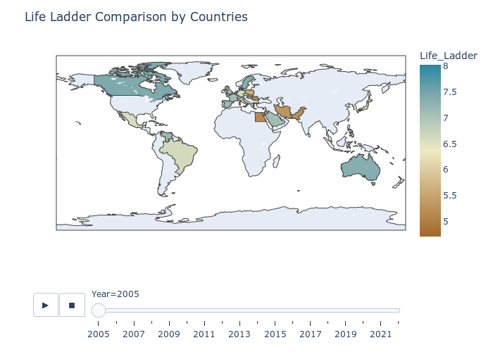
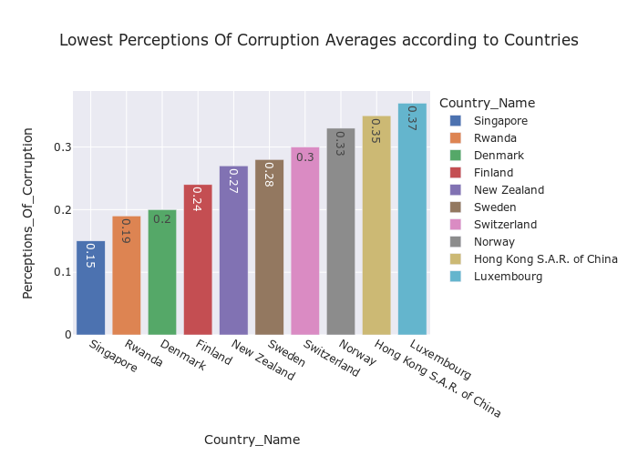
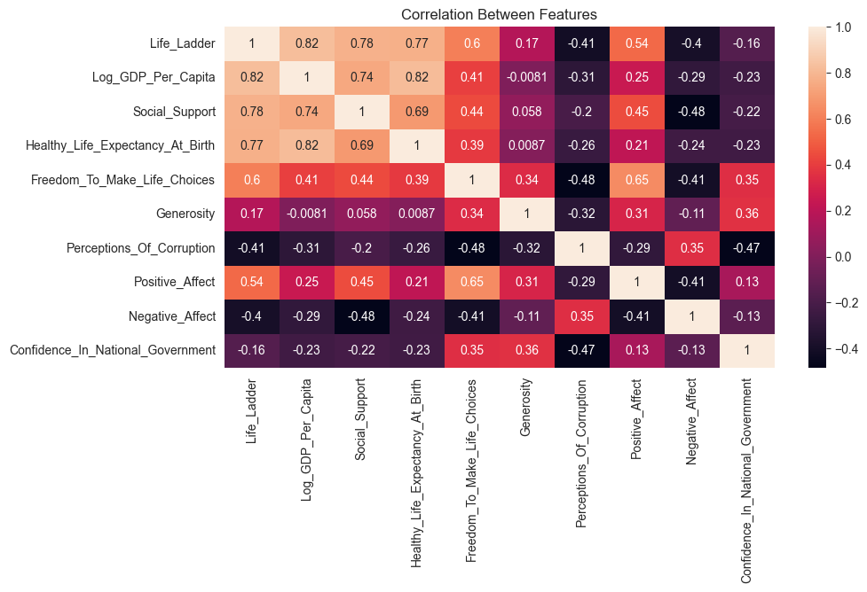
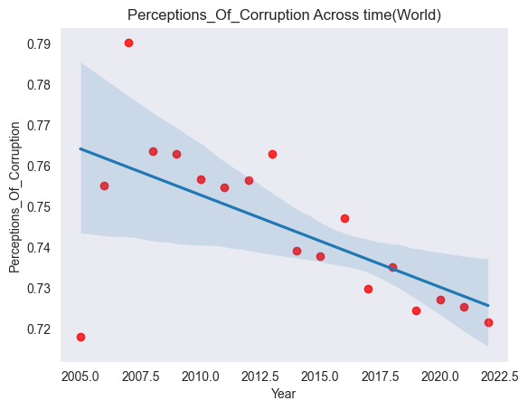

# World Happiness Report Life Ladder Estimator:
#1. Project Overview:
- Created a ML tool the predicts life satisfaction score known as "life ladder" (MAE = 0.268 where 10 is a perfect life) 
- Linear regression, Lasso regression, ridge regression, Random forest, Adaboost with different weak-learners, and SVM were explored

- Optimized parameters using GridsearchCV
- Made preprocessing by creating a pipeline
- Created a streamlit web app as frontend 
- The second best model (random forest) was chosen over the best model (Adaboost with random forest) as the best model proved taxing for the performance of my personal machine
---
#2. Code and Recourses:
1. **Python Version** = Python 3.11.1
2. **Packages** = Pandas,numpy, matplotlib, seaborn, sklearn, json, Streamlit, pickle, joblib, plotly

3. **For web framework requirements run**  
```sh
pip install -r requirements1.txt
``` 

4. **videos used**  https://www.youtube.com/watch?v=WLwjvWq0GWA
5. **CSV source with variable explaniation** https://www.kaggle.com/datasets/usamabuttar/world-happiness-report-2005-present 
---
#3. Data cleaning
- Renamed column names to more compatible ones with python
- Changed data types to appropriate ones
- Did imputation with mean as strategy  
- Filled string NaN with "Not specified" 
---
#5. EDA

Feature understanding as well as feaure realtionships were explored visually making use of the full arsenal ranging from simple bar charts to more complex tools like chropleths  
  
   &nbsp; &nbsp; &nbsp; &nbsp;  

---
# Model Building 

Many different models were explored and fine tunned. Below are the results in MAE of ladder.

- Linear Regression = 0.2861
- Lasso Regression = 0.5625
- Ridge Regression = 0.4047
- Random Forest = 0.2675
- Adaboost with RF as estimator = 0.2574
- Support vector regressor = 0.2819

**important note**: eventhough adaboost with RF scored the best, it was not chosen for deployement as it proved too CPU intensive and time consuming for my personal machine. Hence, second best model which is random forest was used.

---
# Model deployment 

After the model pipeline was serialized, a web app was created using **streamlit**.
**to use the app**
1. open your terminal 
2. navigate to this project 
3. ```sh
    streamlit run Model-deployment.py
    ```


    


